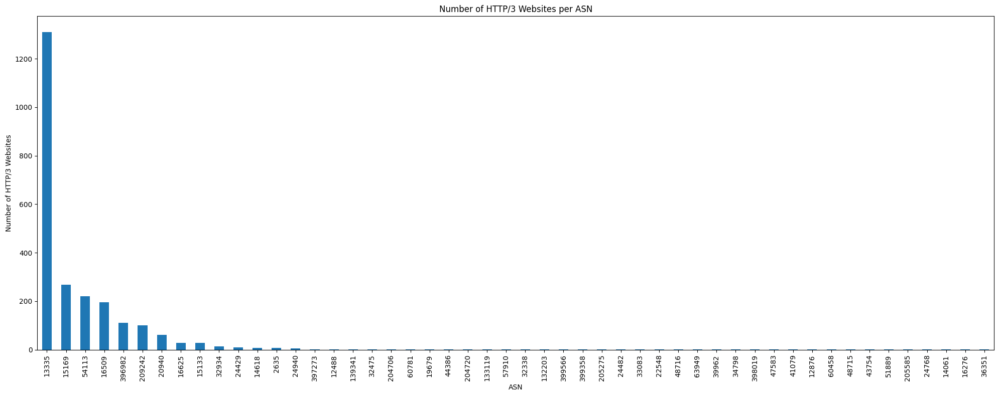

# Task 2: QUIC Adoption
- preprocessing of data (prepend `https://www.` to the domain names) performed in `preprocess.py`
- used a [docker container](https://github.com/yurymuski/curl-http3) to perform curl requests (to avoid building curl with http3-support myself)
- used `curl` with the following flags (besides the ones required for getting metrics):
  - `--http3-only` to enforce use of QUIC
  - `-4` to use IPv4 only
  - `-o /dev/null` to discard the actual output, only want metrics
  - `-s` to suppress curl status messages
  - `--max-time 5` to set connection timeout to 5 seconds, to avoid waiting too long for unresponsive servers
- the following metrics were collected (time metrics in seconds):
    - `time_appconnect`: time from start until the SSL/SSH handshake is completed
    - `time_connect`: time from start until the TCP connect to the remote host (or proxy) is completed
    - `time_namelookup`: time from start until the name resolving is completed
    - `time_pretransfer`: time from start until just before the transfer begins
    - `time_redirect`: time taken for all redirection steps before the final transfer
    - `time_starttransfer`: time from start until the first byte is received
    - `time_total`: total time of the operation
    - `remote_ip`: remote IP address
    - `remote_port`: remote port number
- the `curl` commands were invoked by `curl_http3.py`, multithreaded with `concurrent.futures.ThreadPoolExecutor` using a thread pool of size 10 to speed up the process
- raw results/errors are stored in `curl_http3_results.csv` and `curl_http3_errors.csv`
- in total, 2413 out of the top 10000 domains offered QUIC support
- used `pyasn` package to map IP addresses to ASNs (autonomous system numbers) in `determine_asn.py`
  - `pyasn_util_download.py --latest` to download the latest IP-to-ASN mapping
  - `pyasn_util_convert.py --single <Downloaded RIB File> <ipasn_db_file_name>` to convert the downloaded RIB file to a database
-  (created using `asn_visulization.ipynb`)
- the top 5 ASNs with the most QUIC-supporting domains (2108/2356) are:
  - AS13335 (Cloudflare, Inc.)
  - AS15169 (Google LLC)
  - AS54113 (Fastly, Inc.)
  - AS16509 (Amazon.com, Inc.)
  - AS396982 (Google LLC (Cloud Platform))
- it's evident, that Cloudflare is by far the biggest supporter of QUIC, handling 1252 out of the 2356 QUIC-supporting domains found