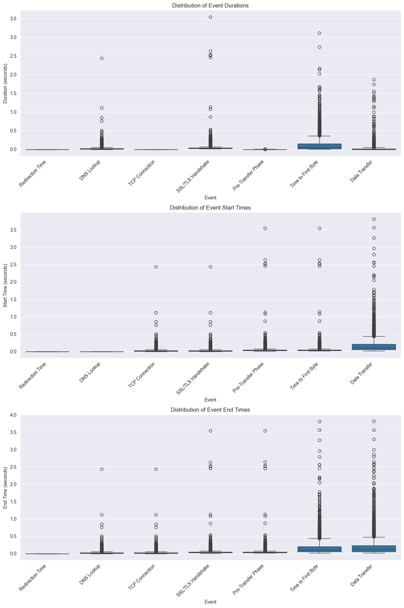
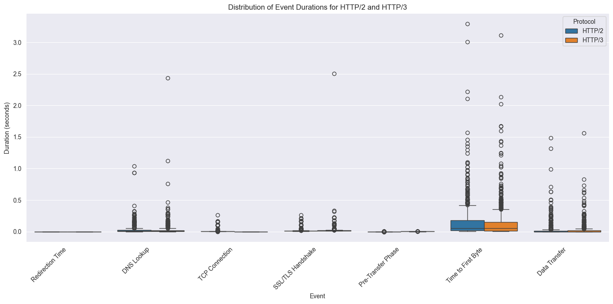
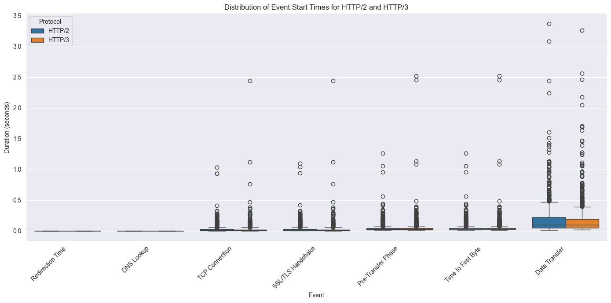
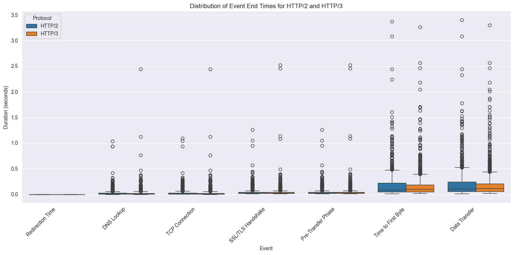

# Task 3: HTTP/3 Latency
| **Event**            | **Start Time**       | **End Time**         | **Duration**                              |
|----------------------|----------------------|----------------------|-------------------------------------------|
| _Redirection Time_   | 0                    | `time_redirect`      | `time_redirect` - 0 = `time_redirect`     |
| _DNS Lookup_         | `time_redirect`      | `time_namelookup`    | `time_namelookup` - `time_redirect`       |
| _TCP Connection_     | `time_namelookup`    | `time_connect`       | `time_connect` - `time_namelookup`        |
| _SSL/TLS Handshake_  | `time_connect`       | `time_appconnect`    | `time_appconnect` - `time_connect`        |
| _Pre-Transfer Phase_ | `time_appconnect`    | `time_pretransfer`   | `time_pretransfer` - `time_appconnect`    |
| _Time to First Byte_ | `time_pretransfer`   | `time_starttransfer` | `time_starttransfer` - `time_pretransfer` |
| _Data Transfer_      | `time_starttransfer` | `time_total`         | `time_total` - `time_starttransfer`       |

- in the case of QUIC, `time_connect` is always 0, as QUIC uses UDP instead of TCP
  - therefore for QUIC, we say that `time_connect` starts and stops immediately after `time_namelookup`
- Boxplots for http3 over start/duration/end-times are generated in `http3_latency.ipynb`
  - 
- curl experiments were also conducted for http2 (for the top 1k domains supporting http3), again using multithreading with `concurrent.futures.ThreadPoolExecutor` and a thread pool of size 10 in `curl_http2.py`
  - raw results/errors are stored in `curl_http2_results.csv` and `curl_http2_errors.csv`
- to compare the latencies of http3 and http2, we added the results of http2 curl to the previous box plots in `http3_http2_latency.ipynb`
  - in order to enable a fair comparison, we choose only the first 1000 domains from the http3 results
  -   
  - 
  - 
- as expected, the time for the redirection time, DNS lookup and pre-transfer phase is roughly the same for both http2 and http3
- since QUIC uses UDP instead of TCP, the time for the TCP connection is 0 for http3, while it's not for http2
- QUIC combines the SSL/TLS handshake in it's connection establishment, therefore the SSL/TLS Handshake times need to be looked at in conjunction with the TCP connection times
  - the SSL/TLS Handshake time is roughly the same for both http2 and http3, while for http2 there is the additional TCP connection time
- to perform some further analysis, we also calculated the differences in raw timing metrics from the top 1k http3 supported domains and their http2 counterparts in `http3_http2_timing_delta.ipynb`
  - the results of the 25th, 50th and 75th percentiles are stored in `http3_http2_differences.csv`
    (all results are in s)
  
| Time Metric (results in s) | **25th Percentile**  | **50th Percentile**  | **75th Percentile**                       | **IQR**  |
|----------------------------|----------------------|----------------------|-------------------------------------------|----------|
| _Name Lookup Time_         |      -0.002684               |  0.000231     |   0.005764   | 0.008448 |
| _Connect Time_             |  0.007898     | 0.017049    |    0.028680    |    0.020782      |
| _App Connect Time_         |-0.005727     |  0.000100      |   0.008225      |   0.013953       |
| _Pre-Transfer Time_        |    -0.007306    | -0.001323    |    0.006483     |     0.013789     |
| _Redirect Time_            | 0.000000    | 0.000000   |  0.000000   |    0.000000      |
| _Start Transfer Time_      |  -0.012943  |0.001044  |0.021439  |    0.034382      |
| _Total Time_               |-0.018119  |-0.000879          |   0.020109   |   0.038228       |
- from these results it can be seen, that on average (50th percentile), http3 roughly performs the same as http2
    - the biggest IQR (measurement of variability) is for the start transfer time (34.382ms), while the smallest is for the redirect time (0ms) / name lookup time (0.008448ms)
    - in the 75th percentile, http3 is faster than http2 in all metrics except, while in the 25th percentile, http3 is slower than http2 in all metrics (excluding the connect time)