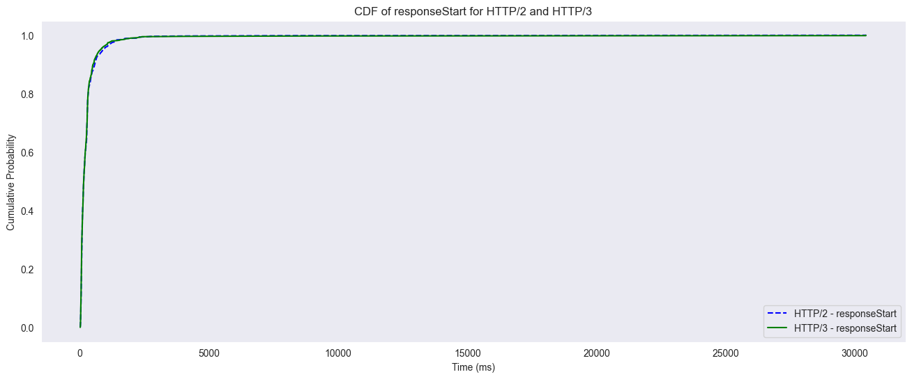
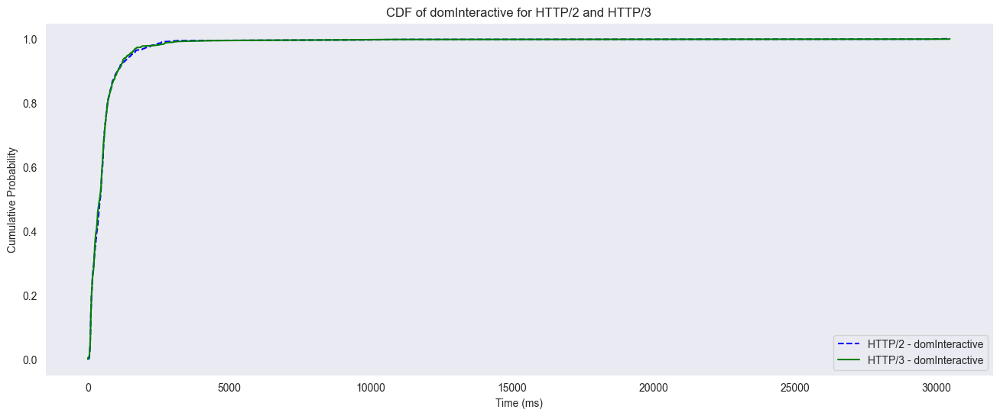
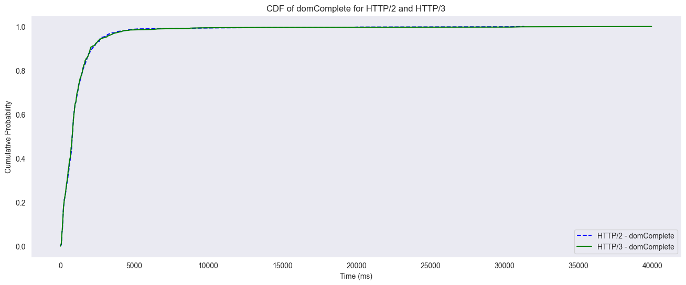

# Task 4: HTTP/3 Rendering Time
- metrics were collected using Selenium in `selenium_http3.py` and `selenium_http2.py`
  - results/errors are available in `selenium_http3_results.csv` and `selenium_http3_errors.csv` for HTTP/3 and `selenium_http2_results.csv` and `selenium_http2_errors.csv` for HTTP/2
- although http3 and http2 use was enforced, some websites redirected to others without keeping the protocol (e.g. `https://doubleclick.net` redirected to `https://marketingplatform.google.com/about/enterprise/` without `http3` support)
  - these cases, as well as failed requests were filtered out in the subsequent analysis
  - in total, 826 out of the top 1000 domains were successfully rendered using HTTP/3 or HTTP/2 and used for the analysis
- explanation of the metrics (all in ms):
  - `responseStart`: time from the start until the browser received the first byte of the response from the server
  - `domInteractive`: time from the start until the browser finished parsing the HTML and the DOM is ready
  - `domComplete`: time from the start until the browser finished parsing the HTML, the DOM is ready, and all resources (images, CSS, etc.) are loaded
- CDF figures for responseStart, domInteractive and domComplete are created in `http3_http2_rendering_time_visulization.ipynb`
  - 
  - 
  - 
- decided to take a look at 10th, 50th as well as 90th percentile deltas (http2 - http3 in ms) to get good overview over best, average and worst cases

| **Percentile**       | **responseStart** | **domInteractive** | **domComplete** |
|----------------------|-------------------|--------------------|-----------------|
| _10th_               | 2.600             | -0.775             | 5.995           |
| _50th_               | 1.900             | 17.700             | 5.700           |
| _90th_               | 60.550            | -7.900             | 126.800         |

- based on these results it can be set that on avg. (50th percentile) http3 outperformed http2 across all metrics
  - dom was interactive roughly 18ms faster in http3 than in http2 and loading the dom was complete roughly 6ms faster in http3 than in http2
  - this leads to lower latency for the user, as the page is interactive and fully loaded faster
- browser always receives the first byte of the response faster in HTTP/3 than in HTTP/2
- in the 10th percentile case, HTTP/3 is faster than HTTP/2 in all metrics except domInteractive, where http2 is slightly faster
- most significant difference is in the 90th percentile case, where HTTP/3 outperformed HTTP/2 for complete dom loading by 126.8ms (domComplete) and for receiving the first byte of the response by 60.55ms (responseStart)